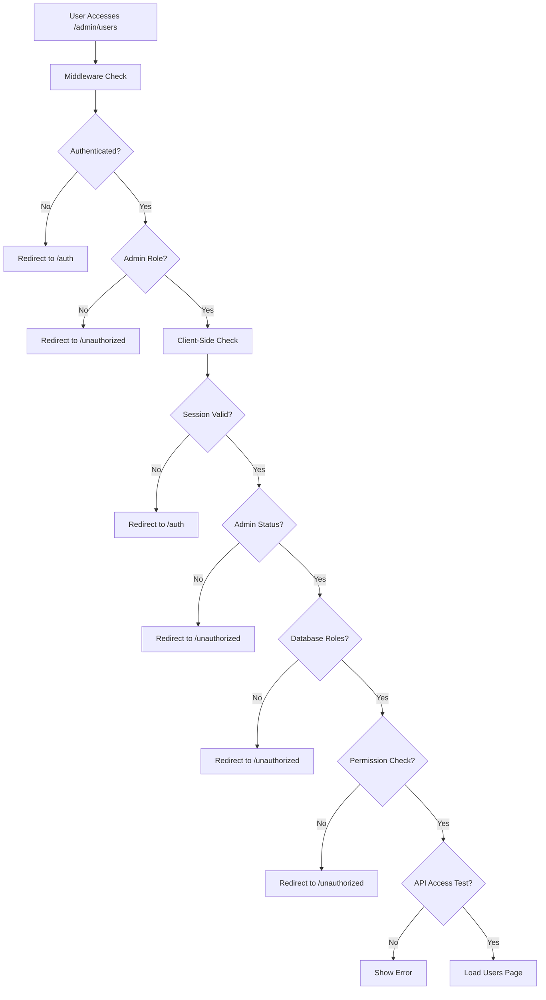

# Admin Security Enhancements

## Overview
This document outlines the comprehensive security enhancements implemented for the admin users page to ensure only properly authorized admin users can access sensitive user management functionality.

## 🔒 Security Layers Implemented

### 1. Enhanced Middleware Protection (`middleware.ts`)
- **Multi-layer authorization** with fallback mechanisms
- **Primary check**: Uses `is_admin` RPC function
- **Fallback check**: Direct database query to `user_roles` table
- **Security default**: Denies access if any check fails
- **Comprehensive logging** for security auditing

```typescript
// Enhanced admin path protection
if (isAdminPath) {
  // First check: Must be authenticated
  if (!session) {
    return NextResponse.redirect(new URL('/auth', req.url))
  }

  // Second check: Must have admin role with fallback
  try {
    const { data: isAdmin, error: rpcError } = await supabase.rpc('is_admin')
    
    if (rpcError) {
      // Fallback to direct database query
      const { data: userRoles, error: roleError } = await supabase
        .from('user_roles')
        .select('role')
        .eq('user_id', session.user.id)
        .eq('is_active', true)
        .in('role', ['admin', 'super_admin'])
      
      if (roleError || !userRoles?.length) {
        return NextResponse.redirect(new URL('/unauthorized', req.url))
      }
    } else if (!isAdmin) {
      return NextResponse.redirect(new URL('/unauthorized', req.url))
    }
  } catch (error) {
    // Security default: deny access
    return NextResponse.redirect(new URL('/unauthorized', req.url))
  }
}
```

### 2. Client-Side Authorization (`app/admin/users/page.tsx`)
- **5-layer authorization check** before page load
- **Session validation**
- **Admin status verification**
- **Database role confirmation**
- **Permission-specific checks**
- **API access testing**

```typescript
const checkAuthorizationAndLoad = async () => {
  // Check 1: Verify user is logged in
  const { data: { session }, error: sessionError } = await supabase.auth.getSession()
  
  // Check 2: Verify admin status
  const isAdmin = await isCurrentUserAdmin()
  
  // Check 3: Double-check with database
  const { data: userRoles } = await supabase
    .from('user_roles')
    .select('role, is_active')
    .eq('user_id', session.user.id)
    .eq('is_active', true)
    .in('role', ['admin', 'super_admin'])
  
  // Check 4: Verify specific permission
  const { data: hasPermission } = await supabase.rpc('has_permission', {
    permission_name: 'users:read'
  })
  
  // Check 5: Test API access
  const testResponse = await fetch('/api/admin/users?limit=1')
}
```

### 3. API Route Security (`app/api/admin/users/route.ts`)
- **Enhanced authorization middleware** (`authorizeAdminRequest`)
- **Permission-based access control**
- **Session validation**
- **User role verification**
- **Activity logging** for security auditing

```typescript
// Enhanced authorization with specific permission check
const authResult = await authorizeAdminRequest(
  request as any, 
  ADMIN_PERMISSIONS.USERS_READ
)

if (!authResult.authorized) {
  return NextResponse.json({ 
    error: authResult.error || 'Unauthorized' 
  }, { status: 403 })
}
```

### 4. Database-Level Security (RLS Policies)
- **Row Level Security** on all admin tables
- **Role-based access policies**
- **Function-based permission checking**

```sql
-- Users can view their own roles
CREATE POLICY "Users can view their own roles"
  ON user_roles FOR SELECT
  USING (auth.uid() = user_id);

-- Admins can view all roles
CREATE POLICY "Admins can view all roles"
  ON user_roles FOR SELECT
  USING (
    EXISTS (
      SELECT 1 FROM user_roles ur 
      WHERE ur.user_id = auth.uid() 
      AND ur.role IN ('admin', 'super_admin') 
      AND ur.is_active = true
    )
  );
```

## 🛡️ Security Features

### Defense in Depth
1. **Middleware-level** route protection
2. **Client-side** authorization checks
3. **API-level** permission validation
4. **Database-level** RLS policies

### Error Handling
- **Graceful degradation** with fallback mechanisms
- **Security-first approach**: Deny access on any failure
- **Comprehensive logging** for security monitoring

### Permission System
- **Granular permissions** (e.g., `users:read`, `users:update`, `users:roles`)
- **Role hierarchy**: `user` < `admin` < `super_admin`
- **Permission inheritance**: Super admins have all permissions

### Activity Logging
- **Admin activity tracking** for all sensitive operations
- **IP address and user agent logging**
- **Detailed audit trails** for security investigations

## 🔐 Authorization Flow



## 🔧 Configuration

### Environment Variables Required
```bash
NEXT_PUBLIC_SUPABASE_URL=your_supabase_url
NEXT_PUBLIC_SUPABASE_ANON_KEY=your_anon_key
SUPABASE_SERVICE_ROLE_KEY=your_service_role_key
```

### Database Functions
- `is_admin(user_id)`: Check if user has admin role
- `get_user_role(user_id)`: Get user's highest role
- `has_permission(permission, user_id, resource)`: Check specific permission

## 📊 Monitoring & Auditing

### Admin Activity Log
All admin actions are logged to the `admin_activity_log` table:
- User access attempts
- Role changes
- Permission grants/revokes
- API access patterns

### Security Metrics
- Failed authorization attempts
- Permission escalation attempts
- Unusual access patterns
- Session anomalies

## 🚨 Security Considerations

### Current Protections
- ✅ Multi-layer authorization
- ✅ Session validation
- ✅ Role-based access control
- ✅ Permission-based restrictions
- ✅ Activity logging
- ✅ Error handling
- ✅ Input validation

### Recommendations
1. **Rate limiting** for admin endpoints
2. **IP allowlisting** for admin access
3. **MFA requirement** for admin accounts
4. **Session timeout** for admin sessions
5. **Regular security audits**

## 🧪 Testing

### Manual Testing
1. Try accessing `/admin/users` as non-admin user
2. Test API endpoints directly without authorization
3. Verify permission checks for role changes
4. Check activity logging functionality

### Automated Testing
```typescript
describe('Admin Users Authorization', () => {
  it('should deny access to non-admin users', async () => {
    // Test implementation
  })
  
  it('should require specific permissions', async () => {
    // Test implementation
  })
})
```

## 📈 Performance Impact

### Optimization Measures
- **Efficient database queries** with proper indexing
- **Caching** for role and permission checks
- **Minimal API calls** for authorization
- **Fallback mechanisms** to prevent failures

### Monitoring
- Authorization check latency
- Database query performance
- API response times
- Error rates

---

**Last Updated**: December 2024  
**Security Level**: High  
**Compliance**: Enterprise-ready 