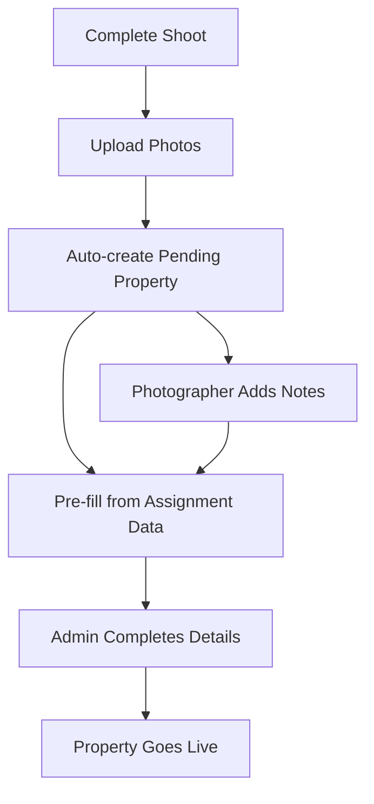

# Photographer Dashboard Specification

## 🎯 Core Vision
A **mobile-first** photographer dashboard that provides read-only schedule management, seamless photo upload workflow that creates pending properties, and real-time assignment updates. Photographers focus on shooting and uploading - admins handle scheduling and property details.

## 📱 Key Design Principles
- **Mobile-First**: Primary usage on smartphones while on-location
- **One-Handed Operation**: Large touch targets, minimal scrolling
- **Offline-Capable**: Core features work without internet
- **Fast Photo Upload**: Optimized for bulk photo management
- **Real-Time Sync**: Instant updates for new assignments

---

## 🏗️ Dashboard Components

### 1. 📊 **Performance Overview Dashboard**
**Location**: Main landing page

#### Key Metrics Cards (Mobile-optimized grid)
- **This Month Stats**
  - Shoots Completed: `12/15 assigned`
  - Photos Uploaded: `847 photos`
  - Avg Rating: `4.8/5.0`
  - Properties Created: `8 pending approval`

- **Today's Performance**
  - Shoots Today: `2 completed, 1 upcoming`
  - Travel Time: `2.5 hours total`
  - Photos Uploaded: `143 photos`

- **Streak & Achievements**
  - Current Streak: `12 days active`
  - This Week: `5/5 shoots completed`
  - Quality Score: `95%` (based on admin feedback)

#### Quick Actions (Thumb-friendly buttons)
- `📅 Today's Schedule`
- `📸 Upload Photos`
- `🗺️ Navigate to Next`
- `📋 Complete Shoot`

---

### 2. 📅 **Schedule & Calendar View**

#### Mobile Calendar Interface
- **Today View**: Default, shows current day timeline
- **Week View**: Horizontal scroll, shows 7-day overview
- **Assignment Cards**: Color-coded by status
  - 🟢 **Confirmed** (green)
  - 🟡 **Assigned** (yellow) 
  - 🔴 **Urgent** (red - same day)
  - 🟦 **Completed** (blue)

#### Assignment Detail Cards
```
┌─────────────────────────────────┐
│ 🏠 Villa Photography            │
│ ⏰ 2:00 PM - 4:00 PM (2h)       │
│ 📍 New Cairo, Compound XYZ      │
│ 👤 Ahmed Mohamed                │
│ 📞 +20 100 123 4567            │
│                                 │
│ [🗺️ Navigate] [📋 Details]     │
│ [📸 Upload Photos]              │
└─────────────────────────────────┘
```

#### Navigation Integration
- **One-tap Google Maps**: Direct deep-link with coordinates
- **Waze Integration**: Alternative navigation option
- **Travel Time Estimation**: Based on current location
- **Traffic Alerts**: Real-time traffic updates

---

### 3. 📸 **Photo Upload & Property Creation Workflow**

This is the **core innovation** - photos automatically create pending properties!

#### Photo Upload Interface
- **Bulk Selection**: Select multiple photos at once
- **Auto-Compression**: Optimize for web while maintaining quality
- **Background Upload**: Continue using app while uploading
- **Progress Indicators**: Clear upload status for each photo

#### Smart Property Creation Workflow


#### Pending Property Auto-Population
When photos are uploaded, system automatically creates:

**Property Record** (Status: `pending_completion`)
- **Location**: From assignment address
- **Client Info**: From lead data
- **Property Type**: From assignment details
- **Photos**: Uploaded images
- **Photographer**: Assignment photographer
- **Shoot Date**: Current date
- **Initial Status**: `photos_uploaded`

#### Photographer Input Options
- **Property Notes**: Special features noticed
- **Recommended Shots**: Suggest additional photos needed
- **Property Condition**: Basic condition assessment
- **Best Feature**: Highlight standout features
- **Shooting Challenges**: Weather, lighting, access issues

---

### 4. 🎯 **Assignment Details & Workflow**

#### Assignment Card Expanded View
```
┌─────────────────────────────────┐
│ 🏠 **Modern Villa Photography** │
│                                 │
│ **📋 Assignment Details**       │
│ • Type: Residential Villa       │
│ • Duration: 2 hours             │
│ • Special Req: Golden hour     │
│ • Equipment: Standard + Drone   │
│                                 │
│ **👤 Client Information**       │
│ • Name: Ahmed Mohamed          │
│ • Phone: +20 100 123 4567      │
│ • Language: Arabic, English    │
│                                 │
│ **📍 Location Details**         │
│ • Address: Villa 123, New Cairo │
│ • Compound: Palm Hills         │
│ • Gate: Gate 3 (Main)          │
│ • Parking: Available on-site   │
│                                 │
│ **🗺️ Navigation**              │
│ [Open in Google Maps]          │
│ [Open in Waze]                 │
│                                 │
│ **📸 Photo Requirements**       │
│ • Exterior: All angles         │
│ • Interior: Living areas       │
│ • Garden: Pool + landscape     │
│ • Special: Sunset shots        │
│                                 │
│ **✅ Workflow Actions**         │
│ [🚗 Mark "En Route"]           │
│ [📍 Mark "Arrived"]            │
│ [📸 Start Shooting]            │
│ [✅ Complete Shoot]            │
│ [📤 Upload Photos]             │
└─────────────────────────────────┘
```

#### Status Update Flow
- **En Route**: GPS tracking starts
- **Arrived**: Check-in at location
- **Shooting**: Timer starts for duration tracking
- **Completed**: Mark shoot as done
- **Photos Uploaded**: Final step

---

### 5. 📱 **Real-Time Notifications**

#### Push Notification Types
- **New Assignment**: `📅 New shoot assigned for tomorrow 2:00 PM`
- **Schedule Change**: `⚠️ Shoot moved from 2:00 PM to 3:30 PM`
- **Urgent Assignment**: `🚨 Last-minute shoot available in 2 hours`
- **Weather Alert**: `🌧️ Rain expected during outdoor shoot`
- **Client Message**: `💬 Client updated access instructions`

#### In-App Notification Center
- **Recent Notifications**: Last 30 days
- **Action Required**: Items needing photographer attention
- **Updates**: Schedule changes, new instructions

---

### 6. 📈 **Performance Analytics**

#### Mobile-Optimized Charts
- **Weekly Overview**: Bar chart of completed shoots
- **Monthly Trends**: Line graph of performance metrics
- **Rating History**: Track client satisfaction over time
- **Efficiency Metrics**: Photos per hour, travel optimization

#### Achievement System
- **Streak Badges**: Consecutive days active
- **Quality Awards**: High client ratings
- **Productivity Milestones**: Photos uploaded, shoots completed
- **Special Recognition**: Admin feedback highlights

---

## 🔧 **Technical Implementation Notes**

### Photo Upload Optimization
- **Progressive Upload**: Start with thumbnails, full res in background
- **Smart Compression**: Reduce file size while maintaining quality
- **Batch Processing**: Handle multiple uploads efficiently
- **Error Handling**: Retry failed uploads automatically

### Real-Time Features
- **WebSocket Integration**: Live updates for assignments
- **Push Notifications**: Critical updates even when app closed
- **Background Sync**: Update data when app reopens

### Offline Capabilities
- **Assignment Cache**: Store upcoming assignments locally
- **Photo Queue**: Save photos for upload when connection restored
- **Status Updates**: Queue status changes for sync

### Mobile Performance
- **Lazy Loading**: Load content as needed
- **Image Optimization**: Serve appropriate sizes for mobile
- **Caching Strategy**: Minimize data usage and load times

---

## 🚀 **Implementation Phases**

### Phase 1: Core Dashboard (MVP)
- Assignment viewing and navigation
- Basic photo upload
- Status updates
- Simple metrics

### Phase 2: Enhanced Workflow
- Smart property creation from photos
- Advanced photo management
- Real-time notifications
- Performance analytics

### Phase 3: Advanced Features
- Offline capabilities
- Advanced analytics
- Achievement system
- Enhanced mobile optimizations

---

## 📐 **Database Schema Considerations**

### New Tables Needed
```sql
-- Photographer status updates
CREATE TABLE photographer_status_updates (
  id UUID PRIMARY KEY,
  assignment_id UUID REFERENCES photographer_assignments(id),
  photographer_id UUID REFERENCES photographers(id),
  status TEXT, -- 'en_route', 'arrived', 'shooting', 'completed'
  timestamp TIMESTAMPTZ,
  location_lat DECIMAL,
  location_lng DECIMAL
);

-- Photo uploads and property creation
CREATE TABLE pending_properties (
  id UUID PRIMARY KEY,
  assignment_id UUID REFERENCES photographer_assignments(id),
  photographer_id UUID REFERENCES photographers(id),
  lead_id UUID REFERENCES leads(id),
  status TEXT DEFAULT 'photos_uploaded',
  photographer_notes TEXT,
  recommended_shots TEXT[],
  property_condition TEXT,
  best_features TEXT,
  shooting_challenges TEXT,
  created_at TIMESTAMPTZ DEFAULT NOW()
);

-- Link photos to pending properties
CREATE TABLE pending_property_photos (
  id UUID PRIMARY KEY,
  pending_property_id UUID REFERENCES pending_properties(id),
  photo_url TEXT NOT NULL,
  is_primary BOOLEAN DEFAULT FALSE,
  order_index INTEGER,
  photographer_caption TEXT,
  upload_timestamp TIMESTAMPTZ DEFAULT NOW()
);
```

---

## 🎨 **UI/UX Mockup Concepts**

### Bottom Navigation (Mobile)
```
[📊 Dashboard] [📅 Schedule] [📸 Upload] [📋 Profile]
```

### Quick Action Floating Button
- Primary: Upload Photos
- Secondary: Navigate to Next, Complete Shoot

### Gesture Controls
- **Swipe Left**: Next assignment
- **Swipe Right**: Previous assignment  
- **Pull Down**: Refresh data
- **Long Press**: Quick actions menu

This dashboard transforms photographers from passive assignment receivers to active contributors in the property creation pipeline while maintaining the admin-controlled scheduling you need! 